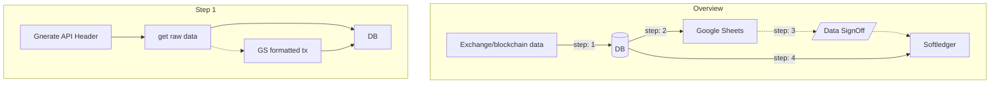

# Flow

Flow consist of implementation plan for softledger uploads based on the data in database(we are using DBql.)

## Table of Content

- Data Source
- Actions
- Flow

### Data Source

Currently, Coinbase Custody data needs to be imported from cb into softledger and google sheets.

### Actions

Following step are involved in doing so,

### Flow Implementation

There are appropriate scripts in py-softledger anything realted to softledger and data ETL scripts are in respective client repo's.

